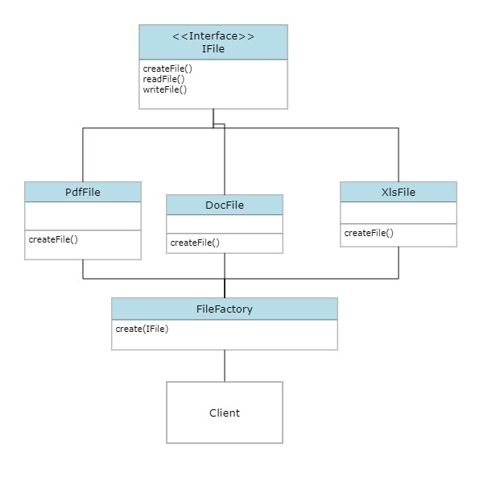

# Factory Design Pattern

### Intent

Factory method is a creational design pattern that provides an interface for creating objects in a superclass, but allows subclasses to alter the type of objects that will be created.

Define an interface for creating an object, but let subclasses decide which class to instantiate.

### Problem

When we need to support the creation of differnt types of object in the system, factory method we need.

For example, we are creating a software service that dupport different types of files to render and edit such as .pdf, .doc, .xls, .py and more. In this situation user need to create object of the particular type using new keyword. Also, if we want to introduce new file type, we have to update our software and may be user of the software also need to update the change.

Factory design pattern solve this issue.

### Solution

Factory method provide an interface to create the objects of different types, and allows sub class to create objects on your behalf.



### CPP Code

```
#include <iostream>

using namespace std;

class IFile
{
public:
    virtual void printFile() = 0;
    virtual void readFile() = 0;
};

class PdfFile : public IFile
{
public:
    void printFile();
    void readFile();
};

void PdfFile::printFile()
{
    cout << "PdfFile::printFile" << endl;
}

void PdfFile::readFile()
{
    cout << "PdfFile::readFile" << endl;
}

class DocFile : public IFile
{
public:
    void printFile();
    void readFile();
};

void DocFile::printFile()
{
    cout << "DocFile::printFile" << endl;
}

void DocFile::readFile()
{
    cout << "DocFile::readFile" << endl;
}
class XlsFile : public IFile
{
public:
    void printFile();
    void readFile();
};

void XlsFile::printFile()
{
    cout << "XlsFile::printFile" << endl;
}

void XlsFile::readFile()
{
    cout << "XlsFile::readFile" << endl;
}

enum FileType {
    PDF = 0,
    DOC = 1,
    XLS = 2
};

class FileFactory
{
public:
    FileFactory();
	~FileFactory();

    static IFile* GetFile(FileType ft);

private:

};


IFile* FileFactory::GetFile(FileType ft)
{
    IFile* filetype = NULL;

    switch (ft)
    {
    case FileType::PDF:
        filetype = new PdfFile();
        break;
    case FileType::DOC:
        filetype = new DocFile();
        break;
    case FileType::XLS:
        filetype = new XlsFile();
        break;

    default:
        break;
    }

    return filetype;
}

int main()
{
    IFile* pdfFile = FileFactory::GetFile(FileType::PDF);
    pdfFile->printFile();
    pdfFile->readFile();

    IFile* docFile = FileFactory::GetFile(FileType::DOC);
    docFile->printFile();
    docFile->readFile();

    IFile* xlsFile = FileFactory::GetFile(FileType::XLS);
    xlsFile->printFile();
    xlsFile->readFile();
}
```
